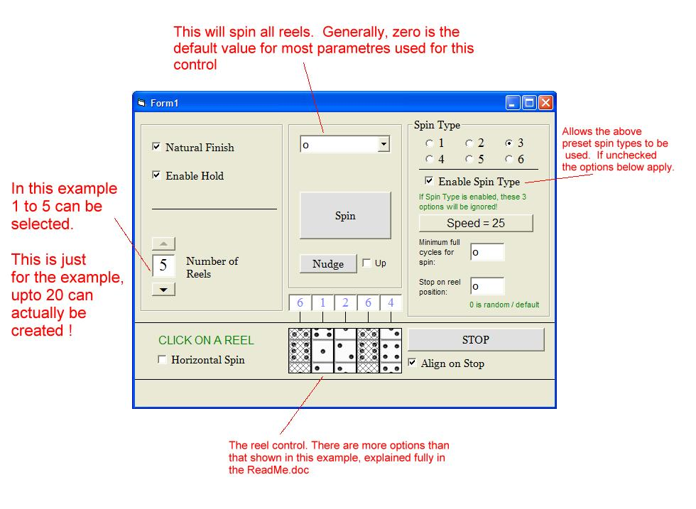



## ActiveX Reel Control \(Slot/Fruit Machine\)

### Description

This ActiveX control uses BitBlt to draw a reel, or reels in a PictureBox and then spin/nudge them. It is quite quick (no Timers !!). Properties include: Reels, PicsPerReel, SpinDirection, NaturalFinish, EnableHold, Etc. It has useful subs/functions like Spin, Nudge, IsHeld, ReelPos, StopSpinning, Etc. Also includes OnReelStart, OnReelStop, OnEachFullCycle, and OnReelClick events. As it uses BitBlt I've included a handy Masker/Spriter program but it's not mine !! Please comment, feedback is much appreciated, but go easy on me - it's my first control!! Full source and an example project included. Enjoy! (Oh yeah - full instructions if you have problems figuring anything out in the ReadMe.doc)
 
### More Info
 
You will need to compile the .ctl file into a .ocx file before using the example project.

             |
---                |---
**Submitted On**   |2002-11-01 23:33:34
**By**             |[Jabba The Schmuck](https://github.com/Planet-Source-Code/PSCIndex/blob/master/ByAuthor/jabba-the-schmuck.md)
**Level**          |Intermediate
**User Rating**    |4.8 (24 globes from 5 users)
**Compatibility**  |VB 4\.0 \(32\-bit\), VB 5\.0, VB 6\.0
**Category**       |[Custom Controls/ Forms/  Menus](https://github.com/Planet-Source-Code/PSCIndex/blob/master/ByCategory/custom-controls-forms-menus__1-4.md)
**World**          |[Visual Basic](https://github.com/Planet-Source-Code/PSCIndex/blob/master/ByWorld/visual-basic.md)
**Archive File**   |[ActiveX\_Re1490841122002\.zip](https://github.com/Planet-Source-Code/jabba-the-schmuck-activex-reel-control-slot-fruit-machine__1-40349/archive/master.zip)

